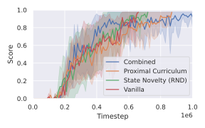

# Novelty-Guided Proximal Curriculum Learning
<!-- ABOUT THE PROJECT -->
## About The Project
This project was created during the course "Advanced Reinforcement Learning" at the Leibniz University Hanover.  
It implements Novelty-Guided Proximal Curriculum Learning, which is based on Proximal Curriculum Learning [[1](#bibliography)] and Random Network Distillation [[2](#bibliography)].

This project tries to speed up learning on sparse reward environments in which starting states may be set freely (e.g. simulations).

It uses PPO from Stable-Baselines3 [[3](#bibliography)] as the agent.  
Doorkey-8x8 and Unlock from MiniGrid [[4](#bibliography)] were used as the environments.  
Hyperparameters were optimized using [[5](#bibliography)].  

<!-- GETTING STARTED -->
## Getting Started
### Installation
Download the project:

```shell
git clone https://github.com/CrunchyFlakes/Novelty-Guided-Proximal-Curriculum-Learning.git
cd Novelty-Guided-Proximal-Curriculum-Learning
```

In case you want the same versions of packages as were used by me, use `fixed_requirements.txt` instead of `requirements.txt` in the following:

#### Conda
Create a conda environment:

```bash
conda create -n ngpcl python=3.12
conda activate ngpcl
pip install -r requirements.txt
```

#### Venv
or a python venv:

```bash
# Make sure you have python 3.12
python -V
python -m venv ngpcl
./ngpcl/bin/activate
pip install -r requirements.txt
```

<!-- USAGE EXAMPLES -->
## Usage

You can run experiments by calling main.py. An example call which first does hpo on doorkey8 using novelty-guided proximal curriculum learning and then evaluates:

```shell
python main.py --approach_to_check comb --trials 100 --workers 20 --env_name doorkey --env_size 8 --mode hpo --n_seeds_hpo 1 --result_dir ./results/
python main.py --approach_to_check comb --env_name doorkey --env_size 8 --mode eval --n_seeds_eval 1 --result_dir ./results/ --eval_seed 0
```

All run results are included in the directories `results` and `plots`.
If you want to reproduce the results (due to SMAC parallelity results may differ slightly), run the following. But be warned as this may multiple days to complete in this not that strongly parallelized version.:

```shell
./full_run.sh 
```

## Results
Here is a short exempt out of the proposal. Read `proposal/proposal.pdf` for more information
<div align="center">
    <h4 align="center">Result plot for the different approaches on Doorkey-8x8</h4>
    
</div>

## Bibliography

[1]G. Tzannetos, B. G. Ribeiro, P. Kamalaruban, and A. Singla, “Proximal Curriculum for Reinforcement Learning Agents,” Trans. Mach. Learn. Res., vol. 2023, 2023, [Online]. Available: https://openreview.net/forum?id=8WUyeeMxMH

[2]Y. Burda, H. Edwards, A. J. Storkey, and O. Klimov, “Exploration by Random Network Distillation,” CoRR, vol. abs/1810.12894, 2018, [Online]. Available: http://arxiv.org/abs/1810.12894

[3]A. Raffin, A. Hill, A. Gleave, A. Kanervisto, M. Ernestus, and N. Dormann, “Stable-Baselines3: Reliable Reinforcement Learning Implementations,” Journal of Machine Learning Research, vol. 22, no. 268, pp. 1–8, 2021, [Online]. Available: http://jmlr.org/papers/v22/20-1364.html

[4]M. Chevalier-Boisvert et al., “Minigrid & Miniworld: Modular & Customizable Reinforcement Learning Environments for Goal-Oriented Tasks,” CoRR, vol. abs/2306.13831, 2023.

[5]M. Lindauer et al., “SMAC3: A Versatile Bayesian Optimization Package for Hyperparameter Optimization,” Journal of Machine Learning Research, vol. 23, no. 54, pp. 1–9, 2022, [Online]. Available: http://jmlr.org/papers/v23/21-0888.html
